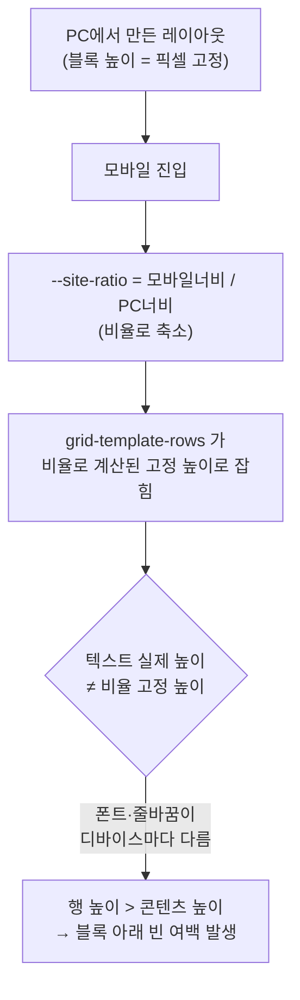

---
tags:
  - qshop
  - cs
  - css
  - responsive
  - css-grid
  - troubleshooting
---

## 현상

채널톡 CS(2026-02-11, 고객 `contigo@contigo.im` / `https://contigo.im/PrivacyPolicy`): **에디터(ED)와 다르게 실제 모바일에서 텍스트 블록과 블록 사이 여백이 비정상적으로 넓게 벌어진다**는 문의.

- 에디터 화면에서는 정상으로 보이는데, 모바일로 실제 접속하면 텍스트 블록 아래에 의도하지 않은 빈 공간이 생김
- **'모두(템플릿)' 이전 당시에도 다수 발생**한 이력이 있고, 그때마다 커스텀 코드로 덮어 해결해 옴 → 단발성이 아니라 **재발 패턴**

## 원인

==에디터의 모바일 반응형 비율 스케일링== 구조에서 비롯된 **근본적인 동작**이다. ("정상인데 비정상으로 보이는" 케이스 — 버그라기보다 설계상 한계)

큐샵 에디터는 PC에서 디자인한 레이아웃을 모바일에서 그대로 재현하기 위해, 페이지를 **CSS Grid + `==--site-ratio==` 배율 변수**로 렌더링한다.



- `--site-ratio`는 **브라우저 너비에 따른 비율**로, PC 기준 디자인을 현재 뷰포트에 맞춰 축소·확대하는 배율이다.
- `grid-template-rows`가 이 비율로 계산된 **고정 높이**로 잡히면, 각 블록(행) 높이가 콘텐츠 실제 높이가 아니라 **PC 디자인을 비율로 환산한 값**으로 강제된다.
- 그런데 텍스트는 디바이스마다 폰트 렌더링·줄바꿈이 달라 **실제 높이가 가변**이다. 비율로 고정된 행 높이가 실제 텍스트보다 크면, 텍스트 블록과 다음 블록 사이에 빈 공간이 남는다.
- 즉 **"반응형이 되면서 간격(여백)까지 비율에 같이 반응"**해서 벌어지는 것이며, 에디터 엔진을 고치지 않는 한 근본 해결이 어렵다.

## 처리

해당 섹션에 한해 **모바일에서 비율 스케일링을 끄고 콘텐츠 높이(`auto`)로 흐르게** 덮어쓰는 커스텀 CSS로 대응한다.

```css
@media (max-width: 768px) {
  /* 섹션 ID를 #id 형태로, 여러 개면 콤마로 구분해 기입 */
  #섹션ID {
    --site-ratio: 1;            /* 비율 스케일링 해제 */
    grid-template-rows: auto !important;  /* 행 높이를 콘텐츠 기준으로 */
  }
}
```

- [x] 섹션 ID + `grid-template-rows: auto !important` 로 정상화 (핵심)
- [x] 에디터 근본 수정은 비용이 커, **현재 적용 중인 커스텀 CSS의 잠재 버그만 수정**하는 선에서 처리 종료 (ED 유지보수 일정 별도 등록, 2026-02-12)

> [!warning] 셀렉터 주의 — CSS Module 해시 클래스 금지
> `Style_slimeTextWrap__Fj5ac` 처럼 끝에 붙는 `Fj5ac` 류 해시는 **빌드마다 동적으로 바뀌는 CSS Module 클래스명**이다. 이 클래스를 직접 셀렉터로 잡아 패딩을 주는 코드(예: `div[data-type^="text"] .Style_slimeTextWrap__Fj5ac { padding: ... }`)는 다음 배포에서 클래스명이 달라지면 무력화되므로 **신뢰할 수 없다.** 반드시 `data-type` 같은 안정적인 속성 셀렉터나 섹션 ID 기준으로 작성한다.

> [!tip] 교훈
> 에디터에서는 멀쩡한데 실제 화면에서만 여백·간격이 틀어지면, **PC 디자인을 비율로 환산하는 반응형 스케일링(`--site-ratio` + `grid-template-rows`)**을 먼저 의심한다. 콘텐츠 높이가 가변인 블록(텍스트 등)일수록 비율 고정 높이와 어긋나 빈 여백이 생긴다.
