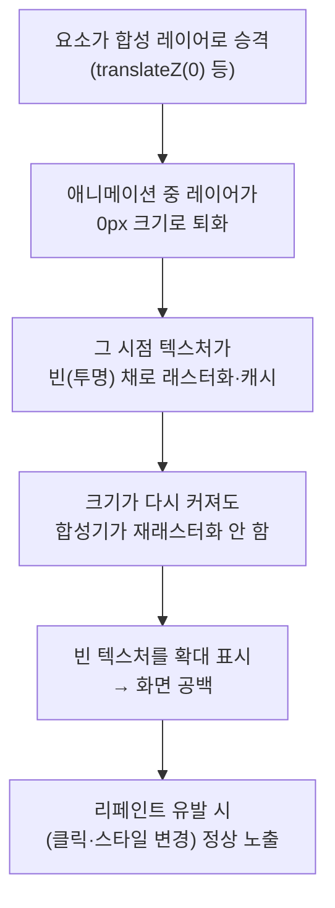

---
tags:
  - gpu-compositing
  - compositor-layer
  - css-animation
  - troubleshooting
---
브라우저는 특정 요소를 ==GPU 합성 레이어(compositor layer)==로 승격해 **텍스처로 래스터화**한 뒤 캐시하고, 이후엔 그 텍스처를 변형(이동·스케일·회전)만 해서 그린다. 이 레이어가 애니메이션 중 **0px로 퇴화**하면 빈 텍스처가 캐시되고, 다시 커져도 **재래스터화되지 않아** 콘텐츠가 보이지 않는 현상이 생긴다.

## 레이어 승격 트리거

다음이 있으면 요소가 자기만의 합성 레이어로 승격된다.

- `transform: translateZ(0)` / `translate3d(...)` (대표적인 GPU 승격 핵)
- `will-change: transform`
- 3D 변형(`rotateX/Y`, `perspective`)이 적용 중인 요소
- `opacity` / `transform` **애니메이션이 실행 중인** 요소 (Chrome 이 자동 승격)

## 빈 텍스처 버그 메커니즘

대표 발생: ==3D flip(`rotateX/Y(90deg)`)== 처럼 요소가 90°에서 **폭/높이 0px로 투영**되는 경우. 2D `scale(0.3)` 처럼 0px 가 안 되는 변형은 안전하다 → [[CSS 2D transform vs 3D transform 래스터화 차이]]

## 진단 신호

> [!tip] 이 두 신호가 같이 보이면 합성 빈 텍스처를 의심
> - **computed style 은 전부 정상**(`opacity:1`, `transform:identity`, 애니메이션 `finished`)인데 **픽셀만 공백**
> - **클릭·스크롤·DevTools 열기** 등 리페인트가 일어나면 뒤늦게 보임 → [[DevTools를 열면 사라지는 렌더링 버그]]

## 해결 패턴

| 방법 | 내용 | 비고 |
|---|---|---|
| **0px 회피** | 회전 각도를 90° 미만(예 60°)으로 제한 | 입체감 유지하며 버그 차단 (권장) |
| **2D 로 대체** | `rotateX/Y` → `scaleY/X` | 버그 0, 입체감 상실 |
| 강제 재래스터화 | 애니메이션 종료 후 레이어 붕괴/리페인트 유발 | 타이밍 의존, 불안정 |
| 레이어 승격 해제 | `translateZ(0)` 제거 | 다른 부작용 가능 |

> [!warning] 효과 없던 시도
> `backface-visibility:hidden`, keyframe 에 `perspective()` 복원 같은 "3D 유지 + 합성 우회" 처방은 환경에 따라 듣지 않는다. **0px 자체를 안 만드는 것**(각도 제한·2D 대체)이 결정적이다.

## 관련 노트

- [[CSS 2D transform vs 3D transform 래스터화 차이]] — 왜 scale 은 안전하고 rotate 는 터지는지
- [[DevTools를 열면 사라지는 렌더링 버그]] — 이 버그의 대표 진단 신호
- [[플립 애니메이션 텍스트 공백]] — 이 개념이 원인이 된 실제 CS 사례
- [[CSS 1px 테두리 렌더링 이슈]] — 같은 `translateZ(0)` GPU 승격을 1px 흐림 방지에 활용하는 사례
