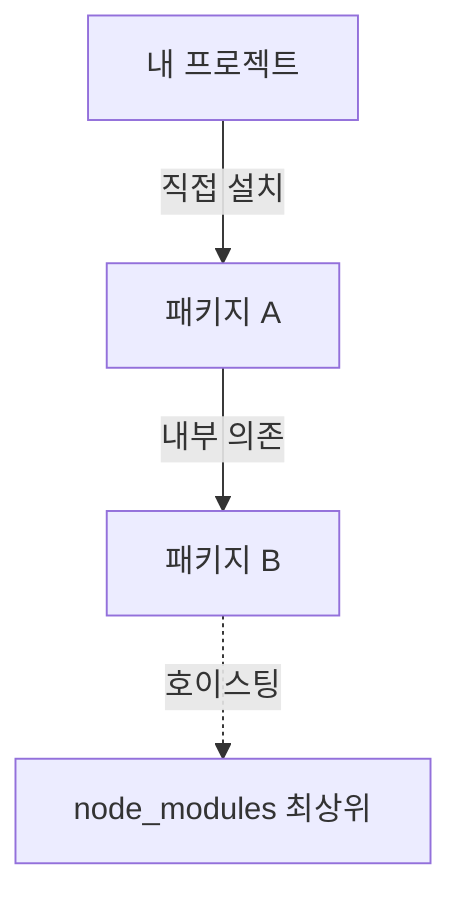

---
tags:
  - hoisting
  - node-modules
  - dependency-management
  - npm
  - pnpm
---
==호이스팅(Hoisting)==은 npm(v3+)·Yarn Classic(v1)이 깊이 중첩된 하위 의존성을 `node_modules` **최상위로 끌어올려 평평하게(flat)** 만드는 기술이다. 핵심 목적은 같은 패키지가 트리 곳곳에 중복 설치돼 디스크를 잡아먹는 문제를 줄이는 것이다.

## 동작

1. 내가 `패키지 A`만 설치한다.
2. A는 내부적으로 `패키지 B`를 필요로 한다.
3. npm이 평탄화를 위해 `패키지 B`를 `node_modules` 최상위로 꺼내 놓는다.
4. Node의 모듈 탐색 규칙상 내 코드에서 `import B`가 에러 없이 동작 → [[팬텀 디펜던시]] 발생.

> [!warning] 평탄화는 디스크 절약엔 효과적이지만, **선언하지 않은 패키지에 코드가 접근 가능해지는** 부작용을 낳는다. 이것이 팬텀 디펜던시의 근본 원인이다.

## 호이스팅을 안 하는 매니저
- **pnpm**: 호이스팅 대신 symlink로 격리 → 선언한 패키지만 접근.
- **Yarn Berry (PnP)**: `node_modules` 자체를 만들지 않음.

## 관련 노트
- [[팬텀 디펜던시]] — 호이스팅의 부작용으로 생기는 미선언 의존성 문제
